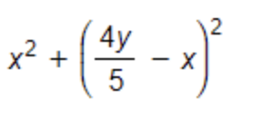

# Lab 1.04: Loops and Version Control

## Instructions

1. **Create a new GitHub repository** named `Enterprise-Java-Development-1.04`.  
2. **Add your instructor and the class graders** as collaborators to your repository.  
   - Make sure that your repository is set to **private**.  
   - Public repositories will receive a zero on the assignment.  
   - If you are unsure who your class graders are, ask your instructor or refer to the Day 1 slide deck.  
3. In the repository, **create a Java project** and add the code for the following prompts.  
4. Once you have finished the assignment, **submit a URL link** to your repository below.

---

## Specifications

### Task 1

Write a Java method that returns the difference between the largest and smallest values in an array of integers. The length of the array must be at least 1.

```java
/**
 * Returns the difference between the largest and smallest values in the array.
 *
 * @param arr an array of integers (length >= 1)
 * @return the difference between max and min values
 */
public static int range(int[] arr) {
    // your implementation here
}
```

### Task 2

Write a Java method that finds the smallest and second smallest elements of a given array and prints them to the console.

```java
/**
 * Finds and prints the smallest and second smallest elements of the array.
 *
 * @param arr an array of integers (length >= 2)
 */
public static void printTwoSmallest(int[] arr) {
    // your implementation here
}
```

### Task 3

Write a Java method that calculates the result of the following mathematical expression, where x and y are two variables that have been pre-set in your code:



```java
/**
 * Calculates the value of the given expression for x and y.
 *
 * @param x first variable
 * @param y second variable
 * @return the result of the expression
 */
public static double calculateExpression(double x, double y) {
    // your implementation here
}
```
