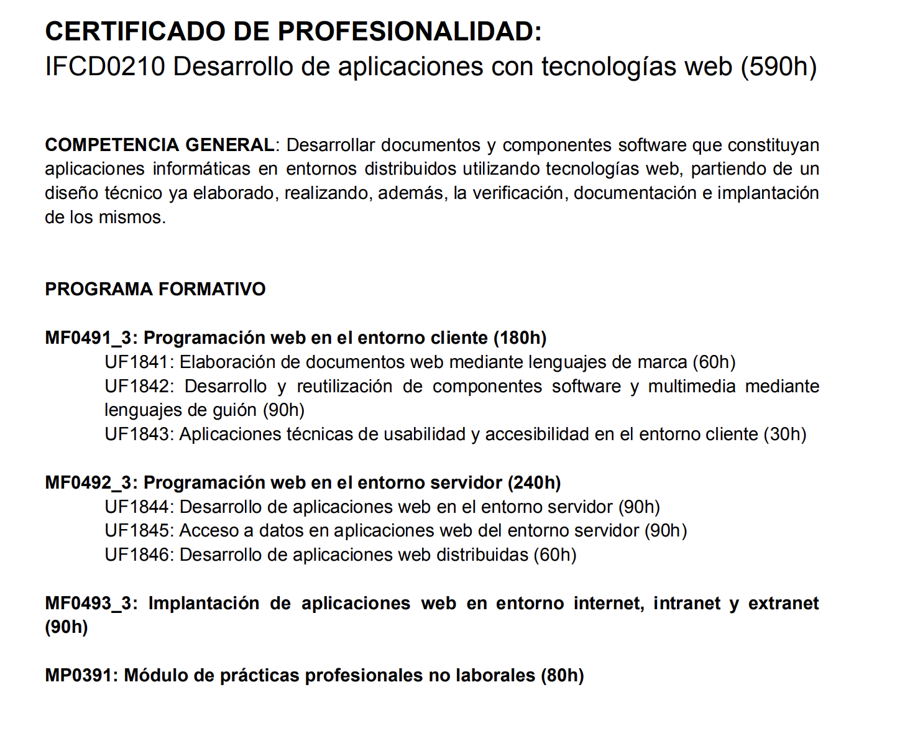

# IronHack Full-Stack Developer Bootcamp

Este repositorio recopila **todo el contenido, ejercicios, prácticas, proyectos y entregas** realizadas durante el Bootcamp Full-Stack Developer de **IronHack (590h)**.

Incluye:
- 💻 Desarrollo Frontend  
- 🖥️ Desarrollo Backend  
- 🚀 Deployment & Cloud  
- 🧪 Testing  
- 🗄️ Bases de datos  
- 🧱 Arquitectura  
- 🛠️ Metodologías de desarrollo

---

---

## Temario del Curso

### 1. Programación web en el entorno cliente
  - **Elaboración de documentos web mediante lenguajes de marcas**: Aprende a crear páginas web utilizando HTML, CSS y otros lenguajes de marcado.
  - **Desarrollo y reutilización de componentes software y multimedia mediante lenguajes de guión**: Uso de JavaScript para crear componentes interactivos y dinámicos.
  - **Aplicación de técnicas de usabilidad y accesibilidad en el entorno cliente**: Mejora la experiencia del usuario en la web, asegurando que sea accesible para todos.

### 2. Desarrollo de elementos software en el entorno servidor
  - **Desarrollo de aplicaciones web en el entorno servidor**: Aprende a trabajar con servidores web y lenguajes como Node.js para crear aplicaciones del lado del servidor.
  - **Acceso a datos en aplicaciones web del entorno servidor**: Aprende a interactuar con bases de datos para guardar y recuperar información.
  - **Desarrollo de aplicaciones web distribuidas**: Crea aplicaciones que se ejecutan en varios entornos, como aplicaciones cliente-servidor o aplicaciones web que se comunican con APIs.

### 3. Implantación de aplicaciones Web en entornos internet, intranet y extranet
  - **Implantación de aplicaciones en diferentes entornos**: Aprende a desplegar aplicaciones en servidores y asegurarte de que funcionen correctamente en diferentes redes y entornos de comunicación.

---

## 📌 Proyectos Destacados

### ⭐ **Full-Stack Final Project – My Recipes (React + Supabase + Netlify)**
🔗 Repo:  
[Proyecto final](https://github.com/LlucMH/IronHack-Full-Stack-Developer/tree/main/Module-03_Deployment/W4%20-%20proyecto)


Aplicación completa con:
- API serverless  
- Dashboard  
- CRUD Recipes  
- Autenticación  
- Hosting CI/CD

---

### ⭐ **Backend Final Project – Bank Back (Java + Spring Boot + PostgreSQL)**
🔗 Repo:  
[Proyecto backend](https://github.com/LlucMH/IronHack-Full-Stack-Developer/tree/main/Module-02_Backend/W12%20-%20project%20-%20bank%20back/project_bank_back)

Proyecto final de Backend con:
- Arquitectura sólida  
- Testing  
- Control de excepciones  
- Persistencia en SQL  
- API REST profesional

---

### ⭐ **Frontend Final Project – IronHack Frontend Project (React)**
🔗 Repo:  
[Proyecto frontend](https://github.com/LlucMH/IronHack-Full-Stack-Developer/tree/main/Module-01_Frontend/W10%20-%20project)

Proyecto Frontend final con:
- React + Hooks  
- Routing  
- Componentes reutilizables  
- Llamadas a API  
- Diseño responsive

---

## 🧰 Tecnologías Utilizadas

### **Frontend**
- HTML5, CSS3, JavaScript
- React, Vite
- TailwindCSS
- DOM, Fetch API

### **Backend**
- Java  
- Spring Boot  
- Maven  
- JPA / Hibernate  
- Testing (JUnit)  
- REST APIs  

### **Deployment / Databases**
- Supabase  
- PostgreSQL  
- Netlify  
- Render / Cloud Hosting  
- CI/CD  
- Docker (básico)

---

## 📖 Módulos

✔️ [Module 01 – Frontend](./Module-01_Frontend/README.md)  
✔️ [Module 02 – Backend](./Module-02_Backend/README.md)  
✔️ [Module 03 – Deployment](./Module-03_Deployment/README.md)

---

## 📂 Estructura del Repositorio

```
IronHack-Full-Stack-Developer/
│
├── Module-01_Frontend/
│   ├── W01D1 - lab 0 - first-html
│   ├── W01D2 - lab 1 - paginas-enlazadas
│   ├── W01D3 - lab 2 - presentacion-web-cantantes
│   ├── W01D4 - lab 3 - formatear-texto-e-imagenes
│   │
│   ├── W02D1 - lab 4 - maquetacion-con-listas-y-divs
│   ├── W02D2 - lab 5 - crear-usar-divs-semanticos-y-ancajes
│   ├── W02D2 - lab 6 - pagina-de-noticias
│   ├── W02D3 - lab 7 - multimedia-en-html
│   ├── W02D4 - lab 8 - html-y-css
│   ├── W02D4 - lab 9 - web-sobre-mi-con-flex
│   │
│   ├── W03D2 - lab 10 - personajes-favoritos
│   ├── W03D2 - lab 11 - bomb-attack
│   ├── W03D2 - lab 12 - de-cuadrado-a-circulo
│   ├── W03D4 - lab 13 - animacion-pelota
│   ├── W03D4 - lab 14 - animacion-anuncio
│   ├── W03D4 - lab 15 - catalogo-de-imagenes
│   │
│   ├── W04D2 - lab 16 - formulario-de-contacto
│   ├── W04D2 - lab 17 - tienda-opciones-pedido
│   ├── W04D2 - lab 18 - formulario-complejo
│   ├── W04D3 - lab 19 - mini-ejercicios-js
│   ├── W05D1 - lab 20 - condicionales-beca-y-gasolina
│   │
│   ├── W05D1 - lab 21 - mini-ejercicios-condicionales
│   ├── W05D2 - lab 22 - lab-javascript-basic-algorithms
│   │
│   ├── W06D1 - lab 23 - functions and arrays
│   ├── W06D2 - lab 24 - greatest movies of all times
│   │
│   ├── W07D3 - lab 25 - ironhack cart
│   ├── W08D2 - lab 26 - componentes
│   │
│   ├── W09D1 - lab 27 - js iron chronometer
│   ├── W09D2 - lab 28 - promise me a diner
│   │
│   └── W10 - project (Final Frontend Project)
│
├── Module-02_Backend/
│   ├── W1 - lab 1 - loops and version control
│   ├── W1 - lab 2 - standard input and classes
│   │
│   ├── W2 - homework - IronBattle
│   ├── W2 - lab 3 - media edades
│   ├── W2 - lab 4 - arrays fijos
│   ├── W2 - lab 5 - interfaces and abstract
│   ├── W2 - lab 6 - cacatua cacahuetes!
│   │
│   ├── W3 - lab 7 - clase ordenador
│   ├── W3 - lab 8 - coleccion bicicletas
│   │
│   ├── W4 - lab 9 - exceptions
│   │
│   ├── W5 - lab 10 - system design
│   ├── W5 - homework - IronSchool
│   │
│   ├── W6 - lab 11 - SQL
│   │
│   ├── W7 - lab 12 - intro to spring boot
│   │
│   ├── W8 - lab 13 - exceptions and testing
│   │
│   ├── W9 - lab 14 - intermediate JPA
│   ├── W9 - lab 15 - modeling complex relationships
│   │
│   └── W12 - project - bank back (Final Backend Project)
│
└── Module-03_Deployment/
    ├── W1 - lab 1 - supabase
    ├── W1 - lab 2 - proyecto react - HTML y CSS
    ├── W1 - lab 3 - proyecto react - Aplicaciones web y MVC
    │
    ├── W2 - lab 4 - rutas
    ├── W2 - lab 5 - añade un formulario a tu proyecto
    │
    ├── W3 - lab 6 - conectate con la API
    │
    └── W4 - proyecto (Final Full-Stack Project)

```
---

## 📜 Licencia
Distributed under the **MIT License**.  
See [`LICENSE`](./LICENSE) for more information.
